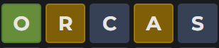

# REGEX Wordle Solver
This script uses python to generate a regex pattern based on your previous wordle guesses that can find all possible solutions to your wordle puzzle. This uses the word list taken from the wordle source code
# How to Use
First open solver.py

1. Make a guess on Wordle
2. Input the word you guessed into the terminal
3. Input the color of each letter as a 5 letter string of either b (black), y (yellow), or g (green). For example: the guess below would be inputted as: `gybyb`
  - 
4. Choose one of the possible solutions found by the solver
5. Repeat

# Motivation
Before this project, I had only used Regex by asking ChatGPT to write the pattern for me. I've always been curious about what each regex token actually does, so I started this project as a fun way to learn more about using Regex. 
This was a big success. Now, instead of asking ChatGPT: 'Write a Regex pattern to match ...', I ask: 'Why doesn't this Regex pattern work? ..."

